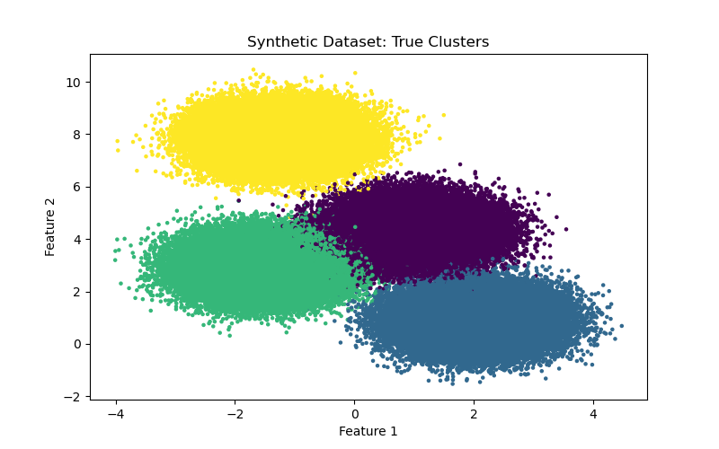
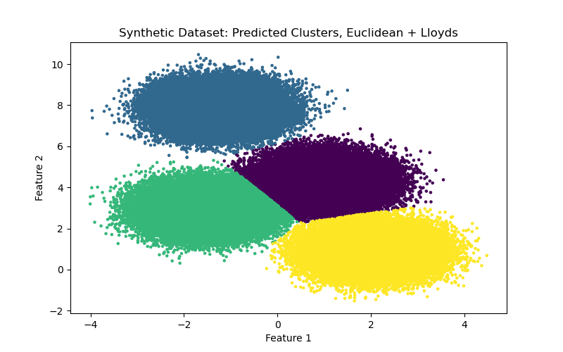
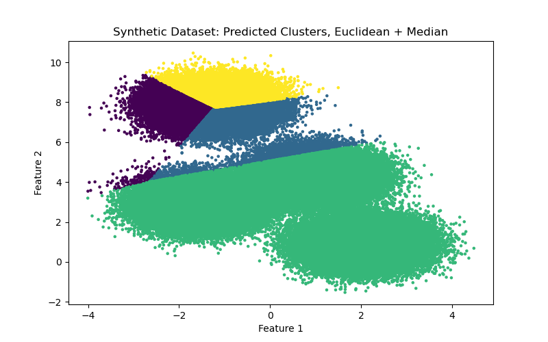
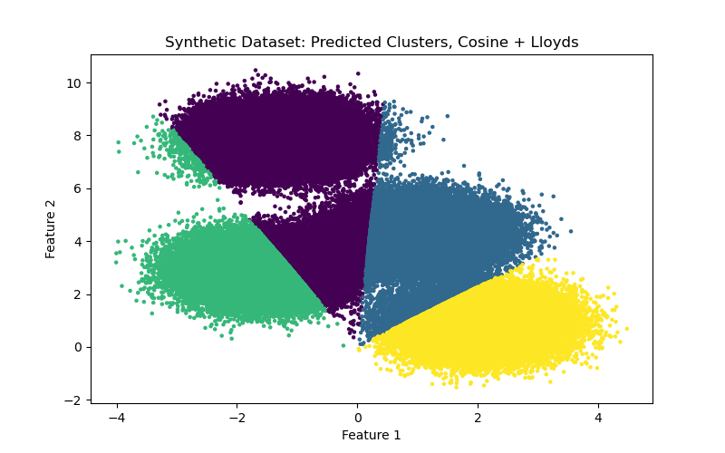
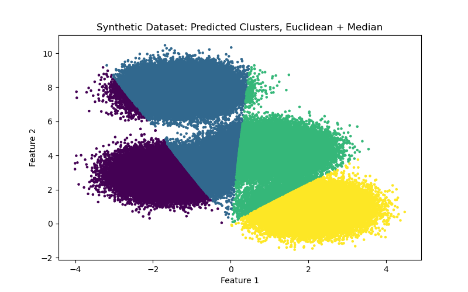

## KMeans Clustering in C++
Varun Mohan

### Overview
The KMeans clustering algorithm is a powerful tool used in data science for unsupervised learning tasks. Specifically, K-Means aims to partition a dataset of observations into $k$ clusters, where each cluster contains a subset of the dataset such that (1) the similarity within a cluster is maximized, and (2) the difference between clusters is maximized. 

This project is a C++ implementation that uses modern C++ features to implement a flexible and efficient K-Means clustering algorithm. It makes use of templates for type safety and flexibility, allowing users to define their own types for data points, distance calculations, and centroid update strategies. The project is structured into several header files, each encapsulating specific functionalities required for the clustering process. It demonstrates the use of several advanced C++ features, including templates, threading, the RAII (Resource Acquisition Is Initialization) standard, inheritance, and polymorphism.

The project also utilizies basic multi-threaded processing for assigning clusters, ensuring thread safety with mutexes. The RAII standard is used for managing resources, ensuring that resources are automatically cleaned up when they go out of scope. Inheritance and polymorphism are leveraged for defining and using different strategies for updating centroids, allowing the algorithm to be easily extended with new methods.

### Datasets
The `main.cpp` file provides an interface for the user to run a K-Means cluster with 3 dataset options:
- [**Iris Dataset:**](https://www.kaggle.com/datasets/uciml/iris) A popular dataset for data science tasks with 3 different species of iris and size measurements for multiple instances of each.
- [**Bean Dataset:**](https://archive.ics.uci.edu/dataset/602/dry+bean+dataset)  A 13,611-observation set about dried beans with 16 features for each observation pertaining to shape and size.
- **Synthetic Dataset:** A purely synthetic dataset created using `scikit-learn` as a proof-of-concept for clustering larger datasets. It has two numerical dimensions and 4 labels, but does not hold any inherent interpretability. Built using the [`make_blobs()`](https://scikit-learn.org/stable/modules/generated/sklearn.datasets.make_blobs.html) method.

### Run Instructions
- **Compile**: `g++ main.cpp [-std=c++20]/[-std=c++20] -pthread -o main`
- **Run**: `./main -i [inputData] -d [distanceStrategy] -u [centroidStrategy] -k [nClusters] -m [maxIterations] -n [nThreads]`
- Options for `inputData` : **`iris`, `beans`, `synthetic`**
- Options for `distanceStrategy` : **`Euclidean`, `Cosine`**
- Options for `centroidStrategy` : **`Lloyds` , `Median`**

Example Run Command:
- `./main.exe -i iris -d Euclidean -u Lloyds -k 3 -m 100 -n 2`

Each dataset has its own output CSV created and hardcoded; clustering results will be deposited to the corresponding file in the `output` directory.

### File Descriptions
Below is a breakdown of each file and the key features of the project.

#### `kmeans.h`
This file defines the `KMeans` class template, allowing it to work with any data type (`T`) and be flexible with the distance calculation method (`Distance`) and centroid update strategy (`UpdateStrategy`). At the moment, the main function providing an interface for the user asssumes a `double` datatype for ease of use, but any numeric data type is compatible with all supporting files.

The `assignClusters` method utilizes C++ threading to parallelize the assignment of data points to the nearest centroid, improving performance for large datasets. To safely update shared data across threads, it uses mutexes, ensuring thread safety when updating the assignments data structure. The use of `std::vector` for managing centroids and assignments leverages RAII for automatic resource management.

#### `centroid.h`
This file defines an `UpdateStrategy` interface using an abstract class. Two specific methods: `LloydsUpdateStrategy` and `MedianUpdateStrategy` inherit from `UpdateStrategy` using runtime polymorphism in order to implement real and distinct strategies for updating centroids. Similar to `kmeans.h`, this uses templates to accommodate different data types. Lloyd's Algorithm, most often used in K-Means, updates a centroid to the mean of all points in its cluster. An alternate method using the median of the cluster is also implemented here as a way to show ease of extension to updating strategies.

#### `datapoint.h`
The `DataPoint` class template is defined here for handling multidimensional data points as vectors. These vectors can contain any type that supports basic arithmetic operations; but current functionality expects all items in a dataset to be of the same numerical type. There are "get" methods for coordinates and labels which are read-only, and a "set" method for coordinates.

#### `distance.h`
There are two different distance strategy templates: `EuclideanDistance`, and `CosineDistance`. Each of these define a `distance` method between two `DataPoint`'s which can affect the progression of the clustering process.

#### `main.cpp`
Processes command-line arguments for flexible configuration of the clustering process. Depending on the command-line arguments, it instantiates the `KMeans` class with different distance and update strategies, using conditional logic based on template parameters.

### Clustering Performance
As an unsupervised task, there are few definitive metrics to determine how well a clustering algorithm is working aside from certain similarity scores. However, we can look visually at 2D examples and judge for ourselves, and this is what we do here with the synthetic dataset. Shown below are visualizations for the true clusters associated with the synthetic dataset, and then visualizations of the clustering algorithm's prediction with each combination of distance strategy and centroid update strategy.

    
     
     
     
     

From the figures above, it seems that the Euclidean distance strategy along with Lloyd's algorithm for centroid updates produced the strongest results for the clustering algorithm, which is somewhat expected. 

### Threading Performance
Multithreading was used to assign clusters after centroid updates on every iteration, which is the most taxing part of the algorithm. To see how much parallelism helped, performance tests were conducted using the Synthetic Dataset. Benchmark tests were all run using **Euclidean** distance with **Lloyd's Algorithm**, as these parameters seemed most indicative of K-means clustering in practice. Results are show below.

| Clusters | Threads | Runtime | Speedup |
| -------- | ------- | ------- | ------- |
| 2        |  1      |  11.88  |  1.00   |
| 2        |  2      |  9.74   |  1.22   |
| 2        |  4      |  12.42  |  0.96   |
| 2        |  8      |  17.22  |  0.69   |
| 4        |  1      |  21.83  |  1.00   |
| 4        |  2      |  14.73  |  1.48   |
| 4        |  4      |  11.59  |  1.88   |
| 4        |  8      |  17.89  |  1.22   |
| 8        |  1      |  42.30  |  1.00   |
| 8        |  2      |  22.77  |  1.86   |
| 8        |  4      |  15.86  |  2.67   |
| 8        |  8      |  18.51  |  2.29   |

There was noticable speedup for increasing threads on all $k$, however speedup did not scale well for higher thread counts. $k=8$ fared the best, achieving a 2.67 speedup for 4 threads, but still fell off of perfect scaling quickly. This is likely because this was a relatively simple implementation of parallelism applied to one part of the algorithm, and it is likely higher threads for fewer clusters led to more contention for the lock when updating assignments. Matching number of threads to $k$ seems to produce the best results.

